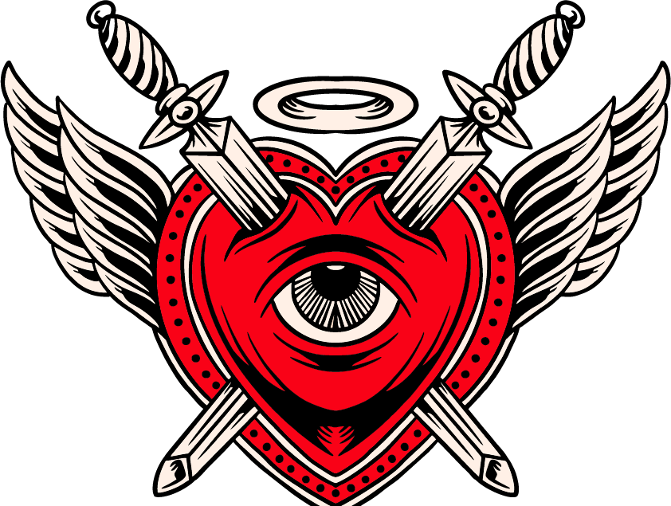

<div align="center">



# Natália Vicente — Nail Designer

**Website institucional** — Website estático, responsivo, sem dependências de build.
Estética: clássico salão de beleza com identidade visual alternativa.

</div>

---

## Sobre

Site de apresentação para o atelier de nail design da **Natália Vicente**.
Construído em HTML, CSS e JavaScript puros, servido como página estática.

A linguagem visual mistura tipografia editorial condensada (Oswald + Playfair Display),
paleta monocromática em preto / vermelho / osso e flourishes em estilo *old-school tattoo flash*.

## Stack

| Camada | Tecnologia |
|---|---|
| Markup | HTML5 semântico |
| Estilos | CSS3 (custom properties, grid, clamp) |
| Script | JavaScript ES6 (vanilla, sem frameworks) |
| Tipografia | Google Fonts — Oswald · Playfair Display · Inter |
| Build | *nenhum* — estático |

## Estrutura do projeto

```
natalia-website/
├── index.html           # página única
├── css/
│   └── style.css        # folha de estilo única, organizada em 17 seções
├── js/
│   └── main.js          # toggle do menu mobile (drawer + backdrop)
├── images/
│   ├── logo.png         # logotipo oficial com texto
│   ├── logo-mark.png    # versão só-ilustração (usada no header)
│   ├── favicon.png      # 256×256, derivado do logo-mark
│   ├── hero-photo.jpg   # retrato principal
│   └── about-photo.jpg  # foto da secção "Sobre"
├── LICENSE
└── README.md
```

## Rodar localmente

Como é um site 100% estático, basta abrir o `index.html` no browser.
Para desenvolvimento com *live reload*, qualquer servidor estático resolve:

```bash
# Python 3
python -m http.server 8080

# Node (npx)
npx serve .

# VS Code
# extensão "Live Server" → clique direito em index.html → "Open with Live Server"
```

Depois: [http://localhost:8080](http://localhost:8080)

## Design tokens

Paleta definida em `:root` em `css/style.css`:

| Token | Valor | Uso |
|---|---|---|
| `--red` | `#EE0310` | primária, CTAs, acentos |
| `--red-deep` | `#C8162E` | gradientes |
| `--red-orange` | `#E5421C` | gradientes quentes |
| `--bone` | `#EEEEEE` | texto sobre fundo escuro |
| `--ink` | `#0A0A0A` | fundo principal |
| `--ink-soft` | `#141414` | fundos secundários |

## Responsividade

Breakpoints mobile-first:

| Largura | Alvo |
|---|---|
| ≥ 700px | serviços 2 colunas |
| ≥ 760px | galeria 3 colunas |
| ≥ 800px | footer 4 colunas · depoimentos 3 colunas |
| ≥ 900px | hero / about / booking em 2 colunas |
| ≥ 960px | nav desktop (hambúrguer desaparece) |
| ≥ 1060px | serviços 3 colunas |
| ≥ 1100px | galeria 4 colunas |

## Acessibilidade

- Landmarks semânticos (`<header>`, `<main>`, `<nav>`, `<footer>`).
- `aria-expanded` / `aria-controls` no toggle mobile.
- `aria-label` em navs e elementos decorativos.
- Foco visível (`:focus-visible` com outline vermelho).
- Fecho do drawer via tecla **Esc** ou clique no backdrop.
- Respeita `prefers-reduced-motion`.
- Contraste AA para texto sobre fundos escuros.

## Seções da página

1. Ticker superior
2. Header com logo + nav + CTA
3. Hero com foto e manifesto tipográfico
4. Marquee *"Garotas rebeldes usam unhas afiadas"*
5. Sobre
6. Carta de serviços (6 itens)
7. Bloco-manifesto em vermelho
8. Galeria / portfólio (8 tiles)
9. Depoimentos
10. Agendamento
11. Footer

## Licença

Ver [LICENSE](LICENSE).

---

<div align="center">
Feito por Victor Prospero. Porto · 2026.
</div>
